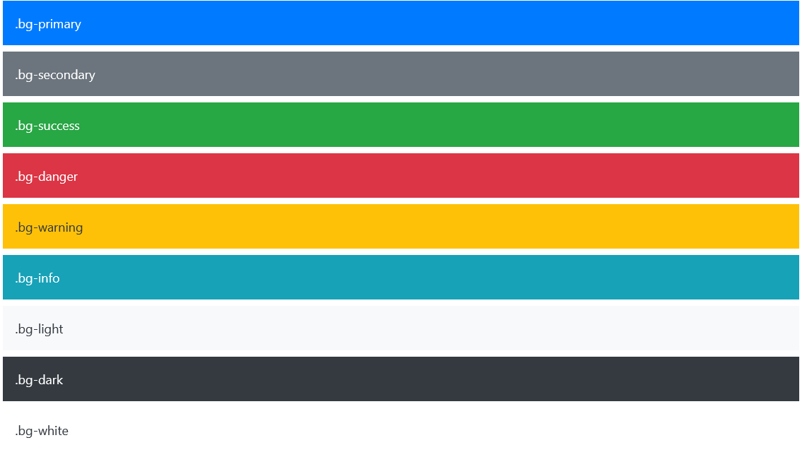

# Projet DashBoard G2F

Ce Projet, a pour but d'exploiter la technologie **DGE-DataGrandEst**.
Il utilise les données géo2france : arbre-plan

## ✂️ Les outils utilisés :
- animation : [**AOS-michalsnik**](https://michalsnik.github.io/aos/)
- mise en forme : [**bootstrap5.2**](https://getbootstrap.com/)
- lire fichier CSV [**PapaParse**](https://www.papaparse.com)

*L'utilisation de l'IDE [**visual studio code**](https://code.visualstudio.com/) avec l'extension [**better comments**](https://marketplace.visualstudio.com/items?itemName=aaron-bond.better-comments) est conseillé pour une meilleure lisibilité du code.*

## 📂Les différents répertoires :

- [**Dist**](./dist/) contient toutes les bibliothèques, framework ou librairies nécessaires au projet.
- [**img**](./img/) contient les images du projet.
- [**data**](./data/) contient les données.
- [**doc**](./doc/) contient la documentation du projet
- [**js**](./js/) contient les scripts JavaScript.
- [**style**](./style/) contient les styles css pour les pages web.

## 📝 Les fichiers principaux :

- [**dist/global.css**](./dist/global.css) Fichier style pour l'outils DGE.
- [**index.html**](./index.html) Page d'acceuil du site : dashboard avec l'outil DGE
- [**example.html**](./example.html/) Page secondaire du site
- [**style/style.css**](./style/style.css) Fichier style pour les paged HTML.
- [**style/checkbox-darkmode.css**](./style/checkbox-darkmode.css) Fichier style du bouton pour changer de mode d'affichage (light -dark)

## 🖍️ Les couleurs avec bootstrap :

Les couleurs du projet sont celle de bootstrap. Pour rajouter une couleur a un élément il suffit de lui rajouter une classe.

> 💡 La classe est composé de : *élément* **-** *NomCouleur*

Ci-dessous exemple de couleur bootstrap pour un arrière-plan :

Il existe de nombreuse autres couleurs bootstrap, pour plus d'informations je vous invite à regarder la [documentation](https://getbootstrap.com/docs/5.2/customize/color/).

## 📅 Les tableaux sous bootstrap :

Sous Bootstrap5 chaque ligne est composée de 12 slots.

> 💡 Un élément de la page (comme une image) peut prendre un nombre de slot sur la ligne. Si l'élément prend 6 slots alors il prendra la moitié de la page.

Dans le [code](./index.html), pour chaque ligne j'explique en commentaire comment est organisée chaque ligne. Ci-dessous la légende :

- **x** correspond à un slot remplis
- **-** à un slot vide 
- **|** à un changement de colonne 

Pour le responsive : 
- **lg** = écran large 
- **sm** : écran small 

Pour plus d'infos sur les tableaux bootstrap : [Grid system](https://getbootstrap.com/docs/5.2/layout/grid/)

## 📊 Les graphiques avec l'outil DGE :

Pour la création de graphique, je vous laisse aller vous renseigner sur la [documentation officielle](https://www.datagrandest.fr/tools/dge-dataviz-components/documentation/documentation-chart.html) de DataGrandEst qui est très bien faite.

## 🎨 Le style

Le fichier [**dist/global.css**](./dist/global.css) permet de modifier les graphiques réalisé à partir de l'outil DGE.

>💡 L'utilisation de ce fichier nécessite le paramètre **localcss** à **TRUE** ou **1** et nommer l'identifiant du grahique par **dge-*type*-light** (*exemple : dge-figure-light*).

## 🗒️ Utilisation liste déroulante

Pour modifier la liste déroulante, il faut modifier le fichier [**js/list.js**](./js/list.js).

- La fonction *selectVille* est executer lorsque l'utilisateur click sur la liste ou le chargment de la page(avec cookie). Il sera ainsi possible de mettre à jour les données dans cette fonction.
- Pour changer les champs dans la liste déroulante. Il faut modifier dans la fonction *papaParse* : data.**nomchampsCSV**

## 🧩 Remarques importantes :

L'outil DGE est incapable de lire les fichiers CSV avec des colonnes : 
- avec un tiret (-)
- avec un espace
- avec un accent
- qui commence par un chiffre

Le zoom lorsque du passage de la souris(class="zoom-1") peut ne pas être compatible avec un DGE-chart. 

>💡 Si création d'un nouveau [carousel](https://getbootstrap.com/docs/5.2/components/carousel/) : pensez à changer l'ID de celui-ci puis reporté cet ID sur les flèches de navigation

